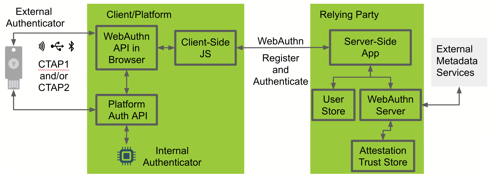

# Securing a Website with Passwordless Authentication
In this workshop you will build upon an existing web application that enables users to register a security key and then use the security key to sign in without typing in a username or password.

## What you'll build:
You'll start with a java web application is integrated with Yubico's WebAuthn Server libraries to enable FIDO2 security key registration and passwordless authentication. 


## What you'll need:
* [Git](https://git-scm.com/)
* [Docker](https://docs.docker.com/install/)
* FIDO2 Compatible browser
  * MacOS: [Safari Technical Preview](https://developer.apple.com/safari/technology-preview/) version 71+
  * Windows 10 Version 1809+: Edge
* A favorite text editor or IDE
* A security key (you have one now!)

## Get Started:
1. Clone the repo
   ```
   git clone https://github.com/YubicoLabs/java-webauthn-passwordless-workshop

   cd java-webauthn-passwordless-workshop
   ```
2. Build the docker image
   ```
   docker build -t example/demo:latest ./4_Authentication/complete/.
   ```
3. Run the image
   ```
   docker run -p 8443:8443 example/demo:latest
   ```
4. Open `https://localhost:8443/` in a CTAP2 compatible browser (Edge on Windows 10 1809+ or Safari Technology Preview on macOS)
5. Sign in with username `user` and password `password`
6. Register a security key
7. Sign out
8. Click `Passwordless sign in` to sign in without typing a username or password

### High Level Components


**FIDO2 Authenticator:**
The authenticator makes credentials, generates cryptographic proof of user authentication, and manages the PIN.

**Client:**
The client is the bridge between the authenticator and the server. It implements the FIDO2 Client to Authenticator Protocol (CTAP) and the WebAuthn API. The client could be a browser exposing the WebAuthn API to web applications, or an OS subsystem exposing a platform-specific FIDO2 API to native applications such as mobile or desktop apps.

**Server:**
The server, also know as Relying Party or RP, consists conceptually of at least a web server and the server-side portions of a web application, plus a WebAuthn server. The WebAuthn server has a trust store, containing the (public) trust anchors for the attestation of FIDO2 Authenticators. Note: a trust store is needed only if RP cares about attestation metadata.

#### Additional WebAuthn Resources
If you need more resources to understand WebAuthn and FIDO2 then
* Read the [WebAuthn Developer Guide](https://developers.yubico.com/FIDO2/FIDO2_WebAuthn_Developer_Guide/Overview.html)
* Review the [Java WebAuthn Server Library Code](https://github.com/Yubico/java-webauthn-server)
* Watch the [Developer Videos](https://www.yubico.com/why-yubico/for-developers/developer-videos/)
